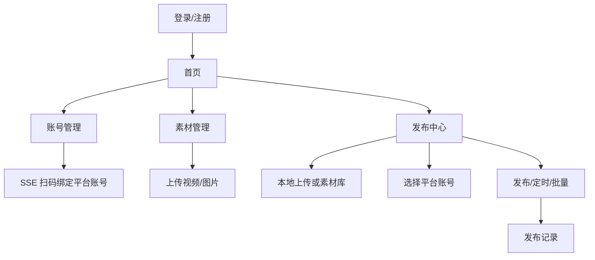

# sau_frontend 页面与 UI 结构说明

> 供 Google Stitch / UI 优化工具使用的项目概览。描述当前页面结构、布局、组件与交互，便于生成改版方案。

---

## 1. 项目定位

**产品名称**：找大状运营系统 / 找大状管理系统（品牌名可通过环境变量配置）

**用途**：多平台社交媒体内容运营后台。支持抖音、快手、小红书、视频号等平台的账号管理、素材管理、视频/图文发布、发布记录查询。

**目标用户**：内容运营、新媒体团队、找大状内部运营人员。

**开发地址**：`http://127.0.0.1:5173`（Hash 路由，如 `#/login`）

---

## 2. 技术栈与 UI 框架

| 项 | 说明 |
|---|---|
| 框架 | Vue 3 + Vite + Composition API (`<script setup>`) |
| 组件库 | Element Plus（表格、表单、对话框、标签、上传等） |
| 路由 | Vue Router 4，**Hash 模式** (`createWebHashHistory`) |
| 状态 | Pinia（`account`、`app`、`user`、`mcpConsole` 等 store） |
| 样式 | Sass + `src/styles/variables.scss` 设计变量 |
| 图标 | `@element-plus/icons-vue` |

---

## 3. 全局布局（已登录主框架）

**文件**：`src/App.vue`

### 3.1 两种布局模式

| 模式 | 路由 | 布局 |
|---|---|---|
| 认证页 | `/login`、`/register` | 全屏，无侧边栏，仅 `<router-view>` |
| 主应用 | 其余需登录页面 | 左侧栏 + 顶栏 + 主内容区 |

### 3.2 主应用 Shell 结构

```
┌─────────────────────────────────────────────────────┐
│ [侧边栏 200px / 折叠 64px]  │ 顶栏 (el-header)      │
│  Logo: 找大状运营系统          │  [折叠]     [用户▼]   │
│  el-menu 深色导航              ├──────────────────────│
│  - 首页                       │ 主内容 (el-main)      │
│  - 账号管理                   │  <router-view>        │
│  - 素材管理                   │                       │
│  - 发布中心                   │                       │
│  - 发布记录                   │                       │
│  - 关于                       │                       │
└─────────────────────────────────────────────────────┘
```

### 3.3 设计 Token（`variables.scss`）

| Token | 值 | 用途 |
|---|---|---|
| 主色 | `#409EFF` | 按钮、菜单激活态 |
| 成功 | `#67C23A` | 正常状态、快手标签 |
| 警告 | `#E6A23C` | 视频号标签 |
| 危险 | `#F56C6C` | 抖音标签、删除按钮 |
| 信息 | `#909399` | 次要文字 |
| 侧边栏背景 | `#001529` | 深色导航 |
| 页面背景 | `#f2f3f5` | 主内容区 |
| 文字主色 | `#303133` | 标题 |

### 3.4 平台标签色约定（全站统一）

| 平台 | el-tag type |
|---|---|
| 快手 | `success`（绿） |
| 抖音 | `danger`（红） |
| 视频号 | `warning`（橙） |
| 小红书 | `info`（灰蓝） |

### 3.5 环境变量（品牌）

`.env.development`：

```env
VITE_APP_BRAND_NAME=找大状
```

登录页标题为 `{VITE_APP_BRAND_NAME}管理系统`；侧边栏 Logo 文案目前硬编码为「找大状运营系统」。

---

## 4. 路由与页面清单

| 路径 | 页面文件 | 需登录 | 说明 |
|---|---|---|---|
| `#/login` | `views/Login.vue` | 否 | 登录 |
| `#/register` | `views/Register.vue` | 否 | 注册 |
| `#/` | `views/Dashboard.vue` | 是 | 首页仪表盘 |
| `#/account-management` | `views/AccountManagement.vue` | 是 | 账号管理 |
| `#/material-management` | `views/MaterialManagement.vue` | 是 | 素材管理 |
| `#/publish-center` | `views/PublishCenter.vue` | 是 | 发布中心 |
| `#/publish-records` | `views/PublishRecord.vue` | 是 | 发布记录 |
| `#/about` | `views/About.vue` | 是 | 关于系统 |
| `#/xiaohongshu/*` | `views/xiaohongshu/*` | 是 | 小红书 MCP 实验模块（未进主侧边栏） |

---

## 5. 各页面 UI 详解

### 5.1 登录页 `/login`

**文件**：`src/views/Login.vue`

**布局**：全屏深蓝渐变背景 `#001529 → #003a70`，内容居中，最大宽 440px。

**区块**：

1. **品牌 Header**（卡片上方，白字）
   - 品牌名小字（letter-spacing 加宽）
   - 主标题：`{品牌名}管理系统`
   - 描述：多平台账号与内容发布说明

2. **登录卡片**（`el-card`）
   - 标题：「登录」
   - 表单：用户名、密码（各最多 15 字符）
   - 按钮：「登录」「注册账号」

**优化建议点**：与注册页风格统一；可考虑 Logo 图；侧边栏品牌名与 env 联动。

---

### 5.2 注册页 `/register`

**文件**：`src/views/Register.vue`

**布局**：与登录页相同渐变背景 + 居中卡片（**无品牌 Header**，仅卡片内「注册」标题）。

**表单**：用户名、密码、确认密码 → 「注册」「返回登录」

**优化建议点**：与 Login 页补齐品牌区；视觉一致性。

---

### 5.3 首页 `/`

**文件**：`src/views/Dashboard.vue`

**页面标题**：「找大状运营系统」

**区块**：

1. **统计卡片区**（3 列 `el-row`，每列 `el-card`）
   - 账号总数（正常/异常细分）
   - 已接入平台（四平台 tag 数量）
   - 素材总数（视频/图片/其他细分）

2. **快捷操作区**（4 列可点击卡片）
   - 账号管理、素材管理、发布中心、关于系统
   - 每卡片：图标 + 标题 + 短描述

**组件**：`el-card`、`el-tag`、`el-tooltip`、`el-icon`

**优化建议点**：统计卡片视觉层次；快捷入口可增加「发布记录」；数据为空时的空状态。

---

### 5.4 账号管理 `/account-management`

**文件**：`src/views/AccountManagement.vue`（约 1150 行，体量最大）

**页面标题**：「账号管理」

**主结构**：`el-tabs` 五个 Tab（内容结构重复）

| Tab | 过滤平台 |
|---|---|
| 全部 | 全部 |
| 快手 | 快手 |
| 抖音 | 抖音 |
| 视频号 | 视频号 |
| 小红书 | 小红书 |

**每个 Tab 内**：

- **工具栏**：搜索框 + 「添加账号」+ 「刷新」（SSE 批量校验状态）
- **表格** `el-table` 列：头像 | 名称 | 平台(tag) | 状态(tag) | 操作
- **状态**：正常(绿) / 异常(红) / 验证中(灰+loading)；异常可点击触发重新登录
- **操作按钮**（5 个，较拥挤）：编辑 | 刷新状态 | 下载Cookie | 上传Cookie | 删除

**对话框**：

| 对话框 | 用途 |
|---|---|
| 添加/编辑账号 | 平台选择、账号名称、浏览器登录开关；添加时 SSE 展示扫码二维码 |
| （内嵌于对话框） | 二维码区：请求中 / 二维码 / 成功 / 失败 |

**关键交互**：

- 进入页面：仅快速拉列表，不自动全量验 Cookie
- 单行「刷新状态」：REST 校验单个账号
- 顶部「刷新」：SSE 流式批量校验，逐行更新状态

**优化建议点**：

- 操作列按钮过多，可改为「更多」下拉或图标按钮
- 五个 Tab 内容高度重复，可抽组件减冗余
- 表格移动端适配
- 二维码登录对话框 UX（等待态、失败重试）

---

### 5.5 素材管理 `/material-management`

**文件**：`src/views/MaterialManagement.vue`

**页面标题**：「素材管理」

**区块**：

- 工具栏：文件名搜索 + 「上传素材」+ 「刷新」
- 表格：UUID | 文件名 | 文件大小(MB) | 上传时间 | 操作(预览/删除)
- 空状态：`el-empty`

**对话框**：

- **上传素材**：自定义文件名（可选）+ 拖拽多文件上传 `el-upload drag`

**优化建议点**：预览体验（视频/图片）；文件类型图标；批量操作。

---

### 5.6 发布中心 `/publish-center`

**文件**：`src/views/PublishCenter.vue`（约 1535 行，最复杂页面）

**特点**：多 Tab 工作区，每个 Tab 代表一条独立发布任务。

**顶部 Tab 栏**：

- 自定义 Tab 标签（如「发布1」）+ 关闭按钮
- 「添加Tab」「批量发布」

**每个 Tab 内容区（自上而下）**：

| 区块 | 组件 | 说明 |
|---|---|---|
| 发布状态 | `el-alert` | 成功/失败提示 |
| 发布类型 | `el-radio-group` | 视频 / 图文 |
| 素材上传 | 按钮 + 文件列表 | 视频或图片 |
| 平台选择 | `el-radio-group` | 抖音/快手/视频号/小红书（图文不含视频号） |
| 标题 | `el-input` | 必填 |
| 正文 | `el-input textarea` | 图文专用 |
| 话题 | tag 列表 + 弹窗选择 | 推荐话题 + 自定义 |
| 商品链接/标题 | `el-input` | 抖音专用 |
| 封面/草稿/原创 | checkbox/switch | 平台相关 |
| 账号 | tag 展示 + 选择弹窗 | 多选平台账号 |
| 定时发布 | `el-switch` + 时间/频次配置 | 可选 |
| 底部操作 | 取消 / 发布 / 有头发布 | 视频号强制有头 |

**对话框清单**：

| 对话框 | 说明 |
|---|---|
| 选择上传方式 | 「本地上传」/「素材库」 |
| 本地上传 | `el-upload` 拖拽，视频或图片 |
| 选择素材 | 素材库 checkbox 列表 |
| 选择账号 | 按平台过滤的账号 checkbox |
| 添加话题 | 自定义输入 + 推荐话题网格 |
| 批量发布进度 | 进度条 + 各 Tab 发布结果列表 |

**优化建议点**：

- 页面信息密度高，区块多，建议分步向导或折叠面板
- Tab 栏样式可更突出当前任务
- 上传方式选择可改为更直观的卡片式
- 表单校验与必填项视觉提示
- 批量发布进度 UX

---

### 5.7 发布记录 `/publish-records`

**文件**：`src/views/PublishRecord.vue`

**页面标题**：「发布记录」

**区块**：

- **筛选栏**：标题搜索 + 平台/类型/状态下拉 + 搜索/刷新
- **表格**：发布时间 | 类型 | 平台 | 标题 | 账号(tags) | 素材数 | 状态 | 操作(详情/删除)
- 分页：`el-pagination`

**优化建议点**：状态筛选更丰富（queued/running）；详情抽屉；失败原因展示。

---

### 5.8 关于 `/about`

**文件**：`src/views/About.vue`

**布局**：居中卡片 max-width 700px

**内容区块**：系统简介 | 支持平台(tags) | 核心功能(list) | 技术栈(tags)

**优化建议点**：版本号、文档链接；技术栈描述需更新（NestJS + MongoDB）。

---

### 5.9 小红书 MCP 模块 `#/xiaohongshu/*`

**说明**：独立子模块，**未出现在主侧边栏**，需直接访问 Hash 路由。

**布局**：`XhsLayout.vue` = `<router-view>` + 底部 `ExecutionConsole` 控制台

| 子路由 | 文件 | 功能 |
|---|---|---|
| `/xiaohongshu/dashboard` | `XhsDashboard.vue` | MCP 测试入口 |
| `/xiaohongshu/login` | `XhsLogin.vue` | 登录与状态 |
| `/xiaohongshu/feeds` | `XhsFeeds.vue` | 推荐列表 |
| `/xiaohongshu/search` | `XhsSearch.vue` | 内容搜索 |
| `/xiaohongshu/feed-detail` | `XhsFeedDetail.vue` | 帖子详情 |
| `/xiaohongshu/profile` | `XhsProfile.vue` | 用户主页 |
| `/xiaohongshu/publish` | `XhsPlaceholder.vue` | 占位 |
| `/xiaohongshu/card-factory` | `XhsPlaceholder.vue` | 占位 |

**组件**：`FeedCard.vue`、`ExecutionConsole.vue`

**优化建议点**：与主应用 Shell 整合或独立导航；占位页需补全 UI。

---

## 6. 公共 UI 模式（全站复用）

### 6.1 列表页模式

多数业务页采用相同结构：

```
.page-header (h1 标题)
  └── .xxx-list-container
        ├── .xxx-search (搜索 + 操作按钮组)
        ├── el-table 或 el-empty
        └── el-dialog (表单/上传)
```

### 6.2 页面标题样式

`.page-header h1`：各页统一大标题，具体字号在各页 scoped SCSS 中定义。

### 6.3 反馈

- 成功/错误：`ElMessage` 全局 toast
- 确认删除：`ElMessageBox.confirm`
- Loading：按钮 `:loading`、表格 `v-loading`、图标旋转

---

## 7. 用户主流程（供交互优化参考）



---

## 8. UI 优化优先级建议（给 Stitch）

| 优先级 | 页面 | 问题 |
|---|---|---|
| P0 | 发布中心 | 信息过载、步骤不清晰、对话框层级多 |
| P0 | 账号管理 | 操作列按钮过多、五 Tab 重复布局 |
| P1 | 登录/注册 | 品牌区不统一、缺 Logo |
| P1 | 首页 | 视觉较平、缺图表/趋势 |
| P2 | 素材管理 | 预览弱、缺缩略图 |
| P2 | 发布记录 | 详情与失败信息展示不足 |
| P3 | 全局 Shell | 品牌 env 与侧边栏未联动；小红书模块未接入导航 |
| P3 | 关于页 | 内容陈旧、排版简单 |

---

## 9. 文件索引（页面 → 路径）

```
sau_frontend/
├── feat.md                          ← 本文件
├── README.md
├── .env.development                 ← VITE_APP_BRAND_NAME 等
└── src/
    ├── App.vue                      ← 全局布局 Shell
    ├── router/index.js              ← 路由表
    ├── styles/variables.scss        ← 设计变量
    ├── views/
    │   ├── Login.vue
    │   ├── Register.vue
    │   ├── Dashboard.vue
    │   ├── AccountManagement.vue
    │   ├── MaterialManagement.vue
    │   ├── PublishCenter.vue
    │   ├── PublishRecord.vue
    │   ├── About.vue
    │   └── xiaohongshu/             ← MCP 子模块
    ├── components/xiaohongshu/
    ├── stores/                      ← Pinia 状态
    └── api/                         ← 接口封装
```

---

## 10. 给 Google Stitch 的使用说明

1. **优先优化**：发布中心、账号管理、登录注册三处，业务价值与复杂度最高。
2. **保持约束**：继续使用 Element Plus 组件语义，避免引入与现有栈冲突过重的新 UI 库，除非整体换肤。
3. **保留平台色**：四平台 tag 颜色约定用户已熟悉，改版时建议保留映射关系。
4. **响应式**：当前以桌面宽屏为主（侧边栏 200px + 表格），移动端未专门适配。
5. **品牌**：登录页品牌名读 env；主 Shell Logo 文案为「找大状运营系统」，改版时可统一为 `{品牌}运营系统`。
